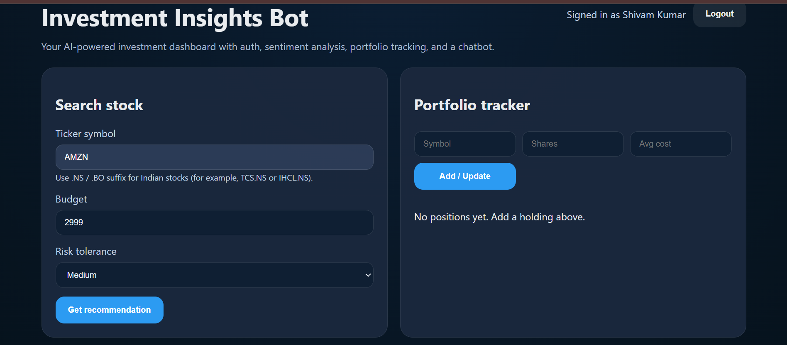
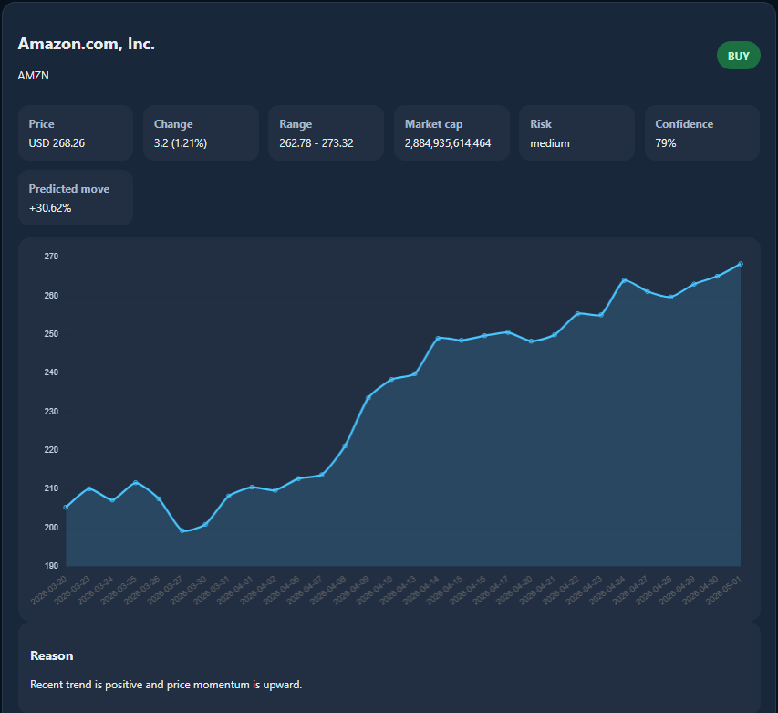
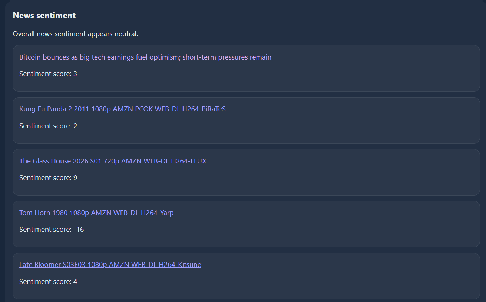
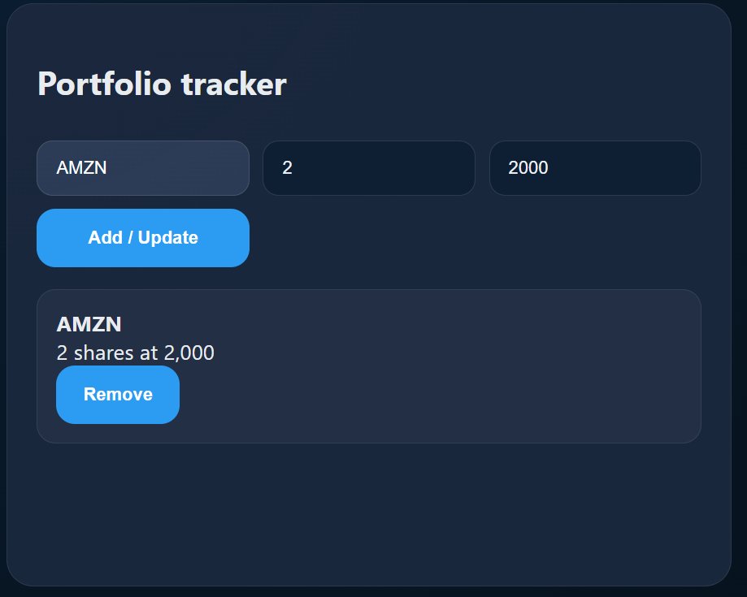
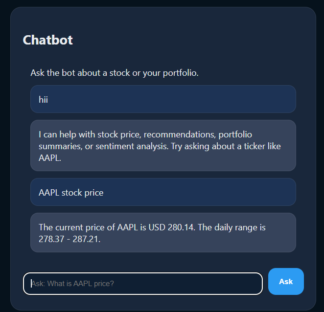
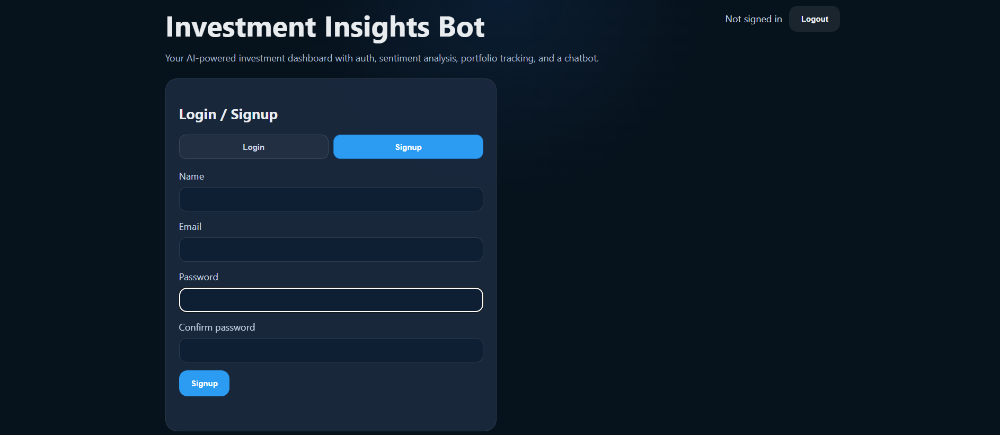

# 📈 Investment Bot

> **An AI-powered stock analysis and investment recommendation system** with real-time market data, news sentiment analysis, and portfolio management capabilities.


---

## 🎯 Project Overview

Investment Bot is a full-stack investment recommendation platform that combines real-time stock market data with AI-powered sentiment analysis. Users can search for stocks, analyze trends, manage portfolios, and receive intelligent investment recommendations based on multiple data sources.

### Key Capabilities
- **Real-time Stock Data**: Live price quotes and historical analysis via Yahoo Finance
- **News Sentiment Analysis**: AI-powered sentiment scoring from financial news articles
- **Smart Recommendations**: Trend analysis with risk assessment
- **User Authentication**: Secure JWT-based authentication system
- **Portfolio Management**: Create and track investment portfolios
- **Search History**: Persistent tracking of user queries
- **Email Alerts**: Optional email notifications for price changes

---

## 📋 Features

### Core Features
✅ **Stock Search & Analysis**
- Real-time stock quote lookup
- Historical price data visualization
- Technical analysis indicators

✅ **AI-Powered Sentiment Analysis**
- News sentiment scoring from NewsAPI
- Emotional trend analysis using machine learning
- Article aggregation and summarization

✅ **User Management**
- Secure user registration and login
- JWT token-based authentication
- User profile management

✅ **Portfolio Management**
- Create and manage investment portfolios
- Track multiple stock positions
- Portfolio performance analytics

✅ **Search History**
- Automatic tracking of all searches
- Quick access to previously viewed stocks
- Searchable history log

### Advanced Features
- Email alert notifications (configured via SMTP)
- PDF portfolio reports
- Risk assessment algorithms
- Trend-based recommendations

---

## 🛠️ Tech Stack

### Frontend
- **HTML5** - Semantic markup
- **CSS3** - Responsive styling
- **JavaScript (ES6+)** - Dynamic client-side logic

### Backend
- **Node.js** - Runtime environment
- **Express.js** - REST API framework
- **JWT** - Authentication tokens
- **Axios** - HTTP client

### Data & APIs
- **Yahoo Finance API** - Stock market data
- **NewsAPI** - Financial news articles
- **Sentiment.js** - Sentiment analysis engine

### Additional Libraries
- **bcryptjs** - Password hashing
- **dotenv** - Environment configuration
- **Nodemailer** - Email notifications
- **PDFKit** - PDF report generation
- **CORS** - Cross-origin request handling

### Optional Components
- **Python** - Linear regression prediction models
- **MongoDB** - Database persistence (ready to integrate)

---

## 📸 Screenshots

### Dashboard & Stock Search

*Main dashboard with real-time stock search functionality*

### Stock Details & Analysis

*Detailed stock information with price history and trend analysis*

### News Sentiment Analysis

*AI-powered news sentiment scores and relevant articles*

### Portfolio Management

*Portfolio overview and performance tracking*

### Investment Recommendations

*AI-generated investment recommendations based on analysis*

### User Authentication

*Secure login and registration interface*

---

## 🚀 Getting Started

### Prerequisites
- **Node.js** (v14.0.0 or higher)
- **npm** or **yarn** package manager
- **NewsAPI Key** (free tier at [newsapi.org](https://newsapi.org/register))

### Installation

1. **Clone or download the project**
```bash
cd investment-bot
```

2. **Install dependencies**
```bash
npm install
```

3. **Configure environment variables**
Create a `.env` file in the root directory:
```bash
# Authentication
JWT_SECRET=your-secure-secret-key-here

# News API Configuration (https://newsapi.org/register)
NEWS_API_KEY=your_newsapi_key_here

# Optional: Email Configuration
EMAIL_HOST=smtp.gmail.com
EMAIL_PORT=587
EMAIL_SECURE=false
EMAIL_USER=your-email@gmail.com
EMAIL_PASS=your-app-password
EMAIL_FROM="Investment Bot" <noreply@investmentbot.com>
```

4. **Start the server**
```bash
npm start
```
The application will be available at `http://localhost:3000`

### Development Mode
For development with auto-restart on file changes:
```bash
npm run dev
```

---

## 📁 Project Structure

```
investment-bot/
├── server.js                 # Express server & API routes
├── package.json              # Dependencies & scripts
├── .env                      # Environment configuration
├── README.md                 # Documentation
│
├── public/                   # Frontend files
│   ├── index.html           # Main HTML page
│   ├── app.js               # Client-side JavaScript
│   └── styles.css           # Styling
│
├── data/                     # Data storage
│   ├── history.json         # Search history logs
│   └── users.json           # User accounts (local storage)
│
├── python/                   # ML models (optional)
│   ├── model.py             # Linear regression predictor
│   └── sample_stock_data.csv # Training data
│
└── screenshots/              # Documentation images
    ├── 01-dashboard.png
    ├── 02-stock-analysis.png
    ├── 03-sentiment-analysis.png
    ├── 04-portfolio.png
    ├── 05-recommendations.png
    └── 06-authentication.png
```

---

## 🔌 API Documentation

### Authentication Endpoints

**Register User**
```http
POST /api/auth/register
Content-Type: application/json

{
  "email": "user@example.com",
  "password": "secure-password"
}
```

**Login**
```http
POST /api/auth/login
Content-Type: application/json

{
  "email": "user@example.com",
  "password": "secure-password"
}
```
*Returns JWT token for authenticated requests*

### Stock Data Endpoints

**Search Stock**
```http
GET /api/search?q=AAPL
Authorization: Bearer {token}
```

**Get Stock Quote**
```http
GET /api/quote/AAPL
Authorization: Bearer {token}
```

**Get News Sentiment**
```http
GET /api/sentiment/AAPL
Authorization: Bearer {token}
```

### Portfolio Endpoints

**Get Portfolio**
```http
GET /api/portfolio
Authorization: Bearer {token}
```

**Add to Portfolio**
```http
POST /api/portfolio
Authorization: Bearer {token}
Content-Type: application/json

{
  "symbol": "AAPL",
  "shares": 10,
  "buyPrice": 150.00
}
```

---

## ⚙️ Configuration Guide

### API Keys Setup

#### NewsAPI Configuration (Required for Sentiment Analysis)
1. Visit [newsapi.org/register](https://newsapi.org/register)
2. Create a free account
3. Copy your API key
4. Add to `.env`:
   ```
   NEWS_API_KEY=your_key_here
   ```

#### JWT Secret
Generate a secure random key for JWT:
```bash
node -e "console.log(require('crypto').randomBytes(32).toString('hex'))"
```
Add to `.env`:
```
JWT_SECRET=generated-key-here
```

#### Email Configuration (Optional)
For email alerts, configure SMTP settings in `.env`:
```
EMAIL_HOST=smtp.gmail.com
EMAIL_PORT=587
EMAIL_SECURE=false
EMAIL_USER=your-email@gmail.com
EMAIL_PASS=app-specific-password
```

---

## 🔒 Security Features

- ✅ **Password Hashing** - bcryptjs for secure password storage
- ✅ **JWT Authentication** - Token-based API authorization
- ✅ **Environment Variables** - Sensitive data in .env file
- ✅ **CORS Protection** - Cross-origin request filtering
- ✅ **Input Validation** - Request body validation
- ✅ **Error Handling** - Secure error messages

---

## 📈 Performance & Optimization

- **Cached Stock Data** - Reduces API calls
- **Sentiment Analysis Cache** - News articles cached per symbol
- **Efficient Database Queries** - Optimized search history
- **Client-side Rendering** - Reduced server load
- **Responsive Design** - Works on all devices

---

## 🗺️ Roadmap & Future Enhancements

### Version 2.0 (Planned)
- [ ] MongoDB integration for persistent data storage
- [ ] Advanced technical indicators (RSI, MACD, Bollinger Bands)
- [ ] Machine learning model integration for price prediction
- [ ] Real-time WebSocket updates for stock prices
- [ ] Mobile app (React Native)
- [ ] Advanced portfolio analytics dashboard
- [ ] Social features (sharing recommendations)

### Version 3.0 (Future)
- [ ] Automated trading execution
- [ ] Risk management algorithms
- [ ] Multi-asset portfolio support (crypto, forex)
- [ ] AI chatbot for financial advice
- [ ] Advanced backtesting tools

---

## 🤝 Contributing

Contributions are welcome! Please follow these steps:

1. Fork the repository
2. Create a feature branch (`git checkout -b feature/AmazingFeature`)
3. Commit changes (`git commit -m 'Add AmazingFeature'`)
4. Push to branch (`git push origin feature/AmazingFeature`)
5. Open a Pull Request

---

## 📝 License

This project is licensed under the MIT License - see the LICENSE file for details.

---

## 💬 Support & Contact

For issues, questions, or suggestions:
- Open an issue on GitHub
- Email: sp483380@gmail.com
- Documentation: [Full Docs](./docs)

---

## ⚠️ Disclaimer

This investment recommendation system is for educational purposes only. It is not financial advice. Always conduct your own research and consult with a qualified financial advisor before making investment decisions. Past performance does not guarantee future results.

---

**Made with ❤️ by the Investment Bot Team**
